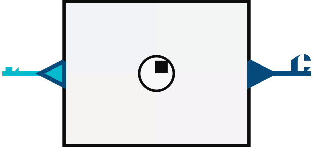
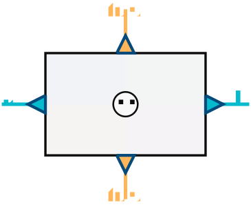
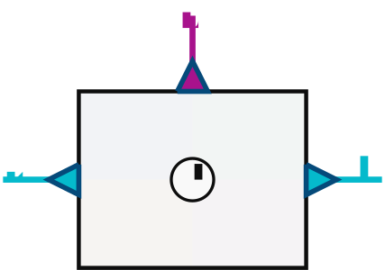
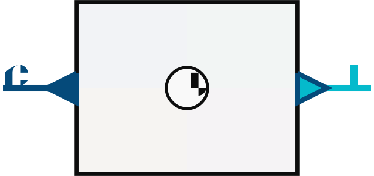
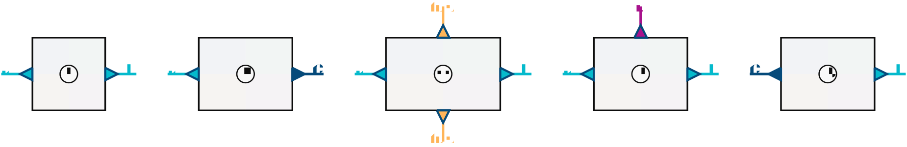

# String diagrams for circuits

A proof-of-concept for rendering 2-cell string diagrams of `Circuit` boxes as SVG.

## Idea

A circuit box is drawn as a 2-cell with wires on four sides:

- **Left/right wires** are the base arrow / `Circuit` / `Kleisli` channels.
- **Top/bottom wires** are the tensor state (`s`, `(,)`, `Either`, `IO`).

Each wire type gets a colour, and the box interior is split into four pastel quadrants.

## Core types

```haskell
-- | Wire type determines colour.
data WireType
  = WireArr        -- ^ base arrow @(->)@ — blue
  | WireCircuit    -- ^ Circuit GADT — green
  | WireState      -- ^ state wire @s@ — yellow
  | WireEither     -- ^ Either tensor — purple
  | WireTuple      -- ^ (,) tensor — orange
  | WireIO         -- ^ IO effect — red

-- | A box is a symbol plus wires on each side.
data Box = Box
  { boxSymbol :: Symbol,
    boxLeftWires :: [Wire],
    boxRightWires :: [Wire],
    boxTopWires :: [Wire],
    boxBottomWires :: [Wire]
  }
```

## Sample boxes

### `lift`



### `ambient`



### `meter`



### `reify`



## Pipeline diagram

A horizontal composition of `f → lift → ambient → meter → reify`:



## Status

Proof-of-concept only. The code lived in `circuits-string` and has been downgraded to this example card.
