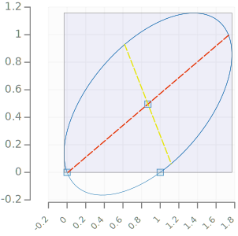
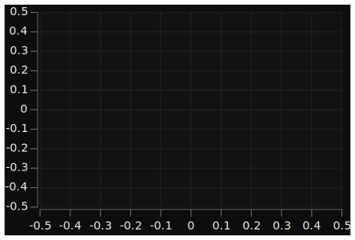
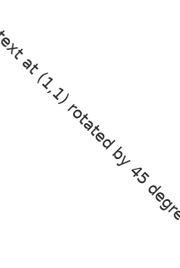
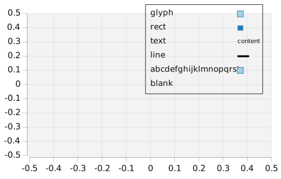
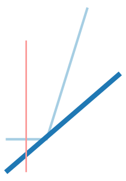
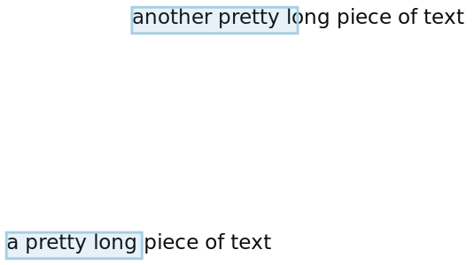

chart-svg
=========

All the charts.

scratchpad
---

subchart
---

blend
---

arc
---

arcflags
---

arrow
---

bar
---

cubic
---

date
---

ellipse
---

glyphs
---

hudoptions
---

hudoptionsdark
---

label
---

legend
---

line
---

path
---

quad
---

rect
---

surface
---

svgoptions
---

text
---

textlocal
---

unit
---

venn
---

wave
---

