# gallery

All example charts from [`Chart.Examples`](src/Chart/Examples.hs) (`pathChartOptions` / `writeAllExamples`).

SVGs use **PreferHud** — HUD ink follows `prefers-color-scheme` (responsive light/dark). Regenerate from the package root:

```haskell
import Chart.Examples
writeAllExamples
```

(Hardcoded dark siblings via `writeAllExamplesDark` → `*d.svg` are optional and not listed here.)

## unit

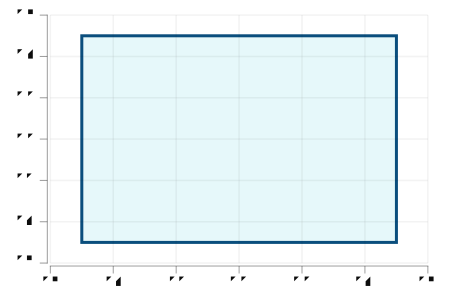

## rect

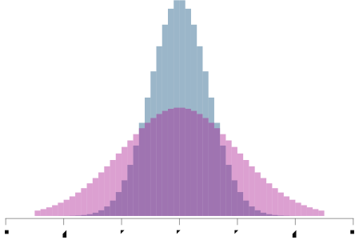

## text

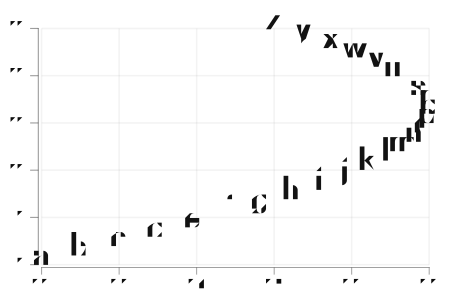

## glyphs


## line

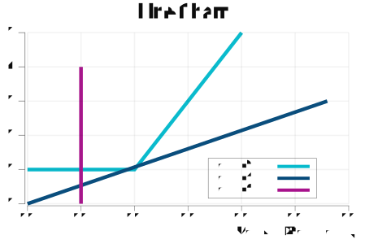

## hudoptions

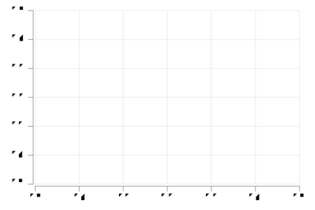

## bar

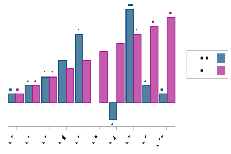

## sbar

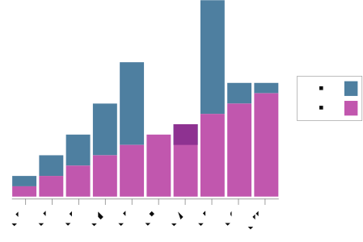

## surface

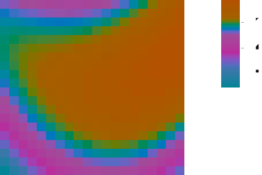

## wave

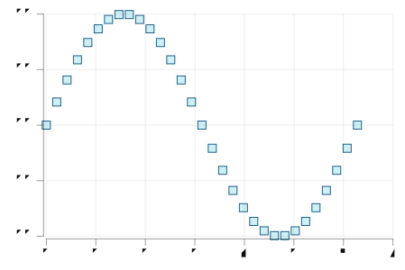

## venn

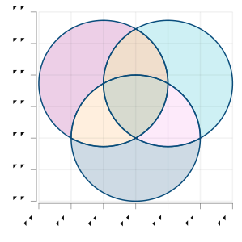

## path

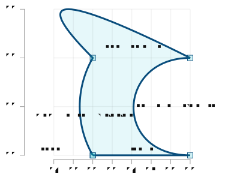

## arcflags

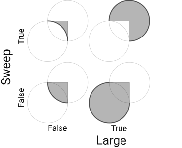

## ellipse

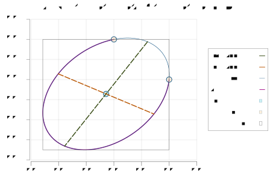

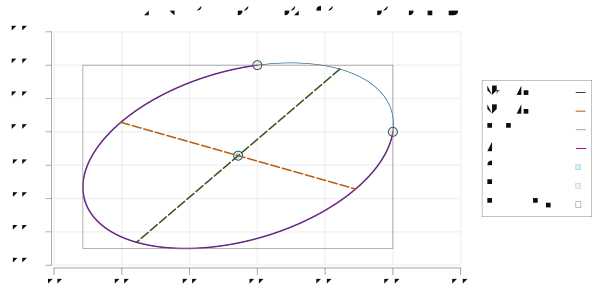

## quad

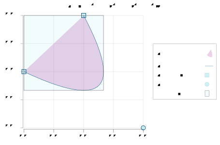

## cubic

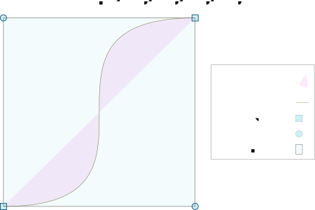

## arrow

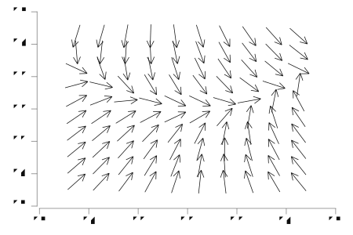

## date

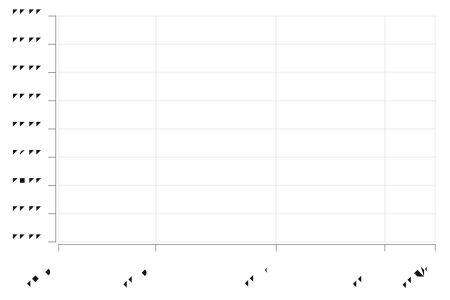

## gradient


## wheel

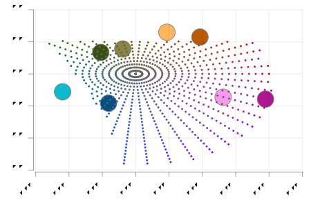

## debug

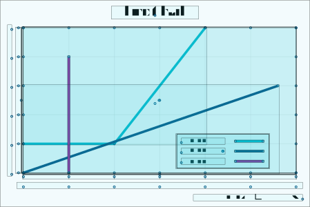

## priorityv1

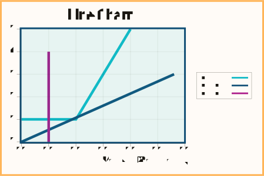

## priorityv2

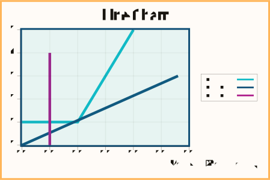

## compound

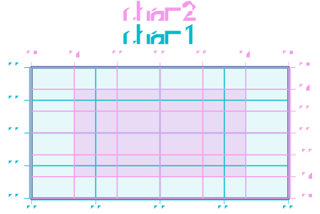

## stack

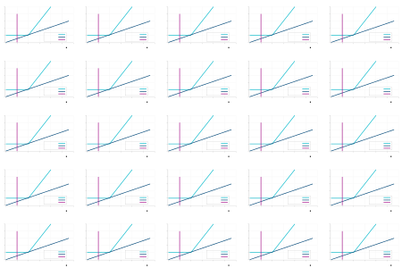
