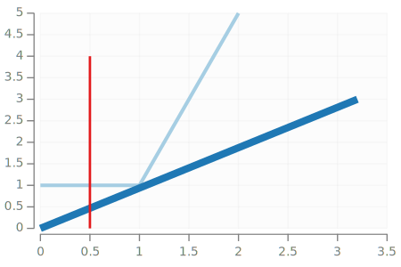

chart-svg
=========

[](https://travis-ci.org/tonyday567/chart-svg)
[](https://hackage.haskell.org/package/chart-svg)

A chart library targetting SVG.

Usage
===

``` haskell
import Chart

main :: IO ()
main = do
  let xs = [[(0.0, 1.0), (1.0, 1.0), (2.0, 5.0)], [(0.0, 0.0), (3.2, 3.0)], [(0.5, 4.0), (0.5, 0)]] :: [[(Double, Double)]]
  let ls = fmap (uncurry P) <$> xs
  let anns = zipWith (\w c -> LineA (LineStyle w c Nothing Nothing)) [0.015, 0.03, 0.01] palette1
  let lineChart = zipWith Chart anns ls
  writeChartSvgHud "lineshud.svg" lineChart
```



Examples
===

See the code in Chart.Examples for practical usage.

Also included is an example which demonstrates reanimate integration.

Chart Types
===

rect


line


text


glyph


bar


surface


